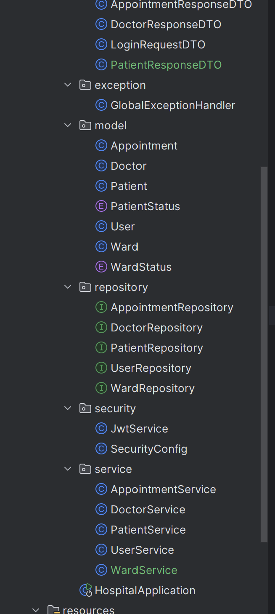

# Hospital Management System

## 📌 Description

A Hospital Management System backend built with Spring Boot that simulates NHS-style hospital workflows.

This project demonstrates backend software engineering concepts including RESTful APIs, layered architecture, authentication, database relationships, and Spring Security integration.

The system supports patient admission, doctor assignment, ward management, and appointment handling.

---

## 🚀 Features

- Patient admission system
- Doctor management
- Ward assignment
- Appointment management
- RESTful APIs
- Spring Security authentication
- H2 in-memory database
- DTO architecture
- Exception handling
- Layered backend structure

---

## 🛠️ Tech Stack

- Java 17
- Spring Boot
- Spring Security
- Spring Data JPA
- Hibernate
- H2 Database
- Maven
- Postman

---

## 📂 Project Structure

- Controllers
- Services
- Repositories
- DTOs
- Models
- Security Configuration
- Exception Handling

---

## 📸 Screenshots

### Get Patients API


---

### Patient Admission API


---

### H2 Database


---

### Project Structure



---

### Project Structure


---

## ▶️ Running the Project

### Clone Repository

```bash
git clone <your-repository-url>
```

### Run Application

```bash
mvn spring-boot:run
```

Application runs on:

```text
http://localhost:8080
```

---

## 🔐 Authentication

Spring Security Basic Authentication is enabled.

Development credentials are generated at application startup and displayed in the console logs.

---

## 📡 Example API Endpoints

### Patients

#### Get All Patients

```http
GET /api/patients
```

#### Admit Patient

```http
POST /api/patients/admit/{wardName}/{username}
```

#### Update Patient Status

```http
PATCH /api/patients/{id}/status
```

#### Discharge Patient

```http
DELETE /api/patients/{id}
```

---

## 📈 Future Improvements

- JWT Authentication
- PostgreSQL integration
- Docker deployment
- React frontend
- Swagger/OpenAPI documentation
- Role-based authorization
