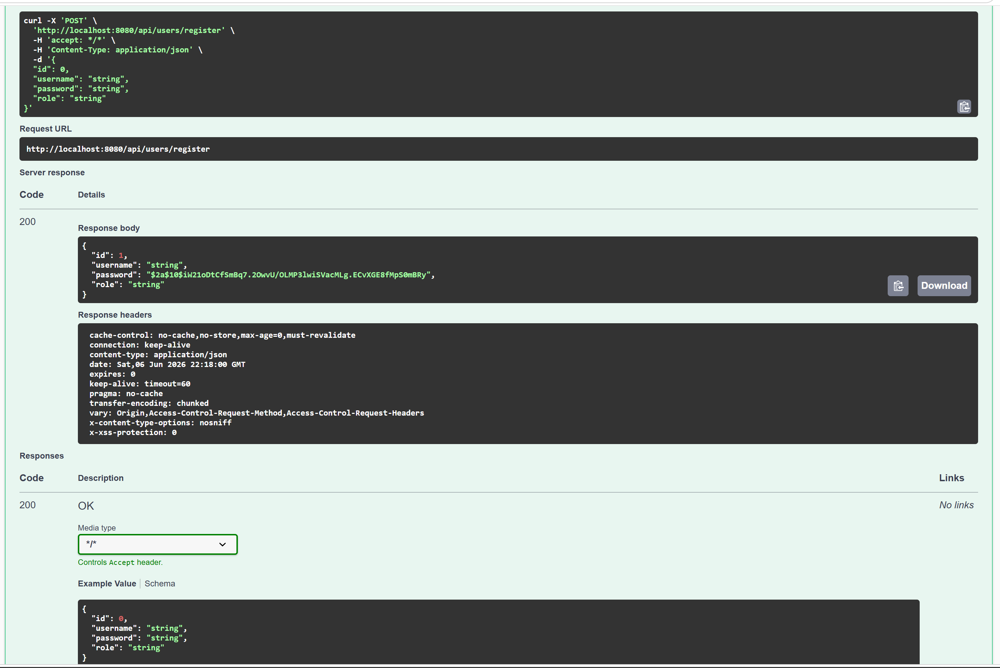
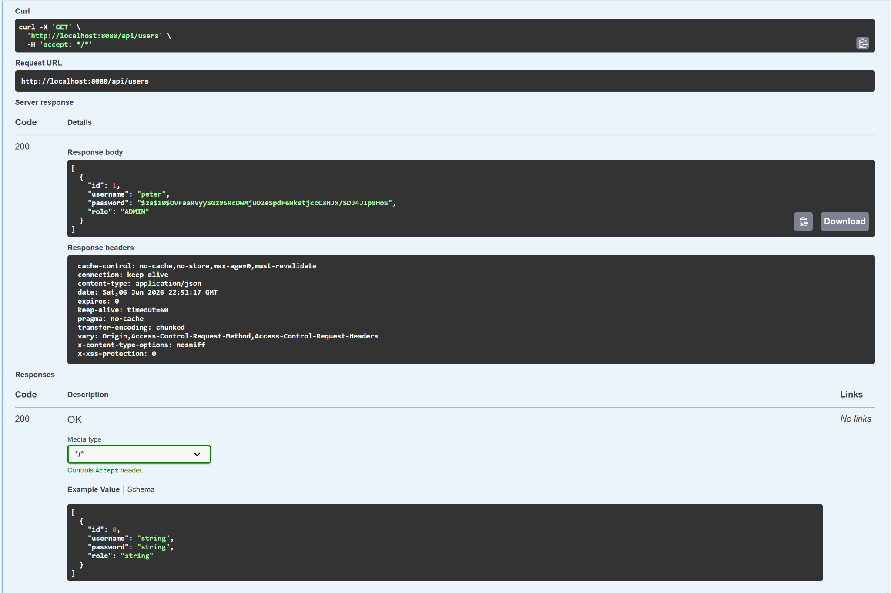
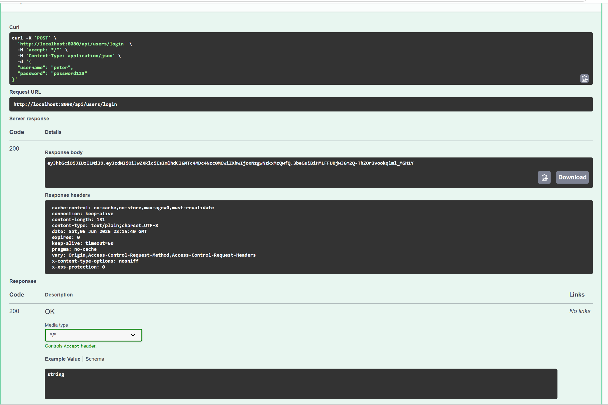
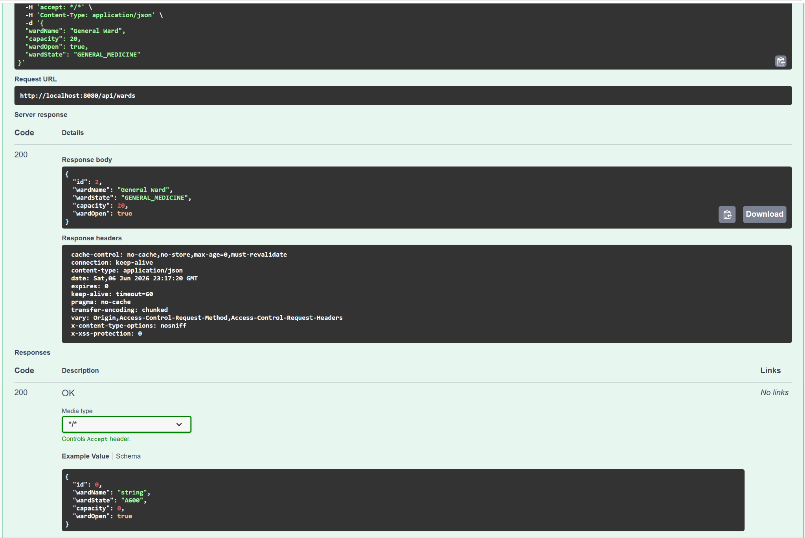
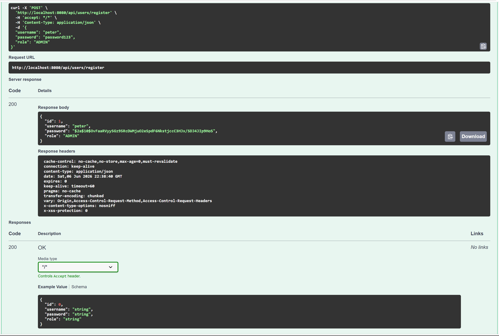
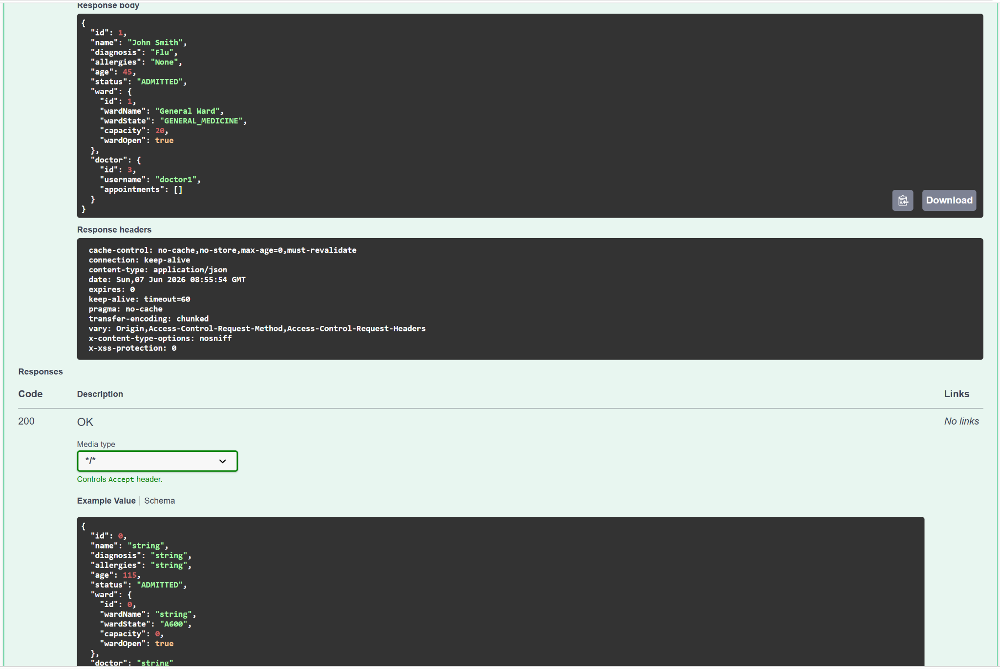
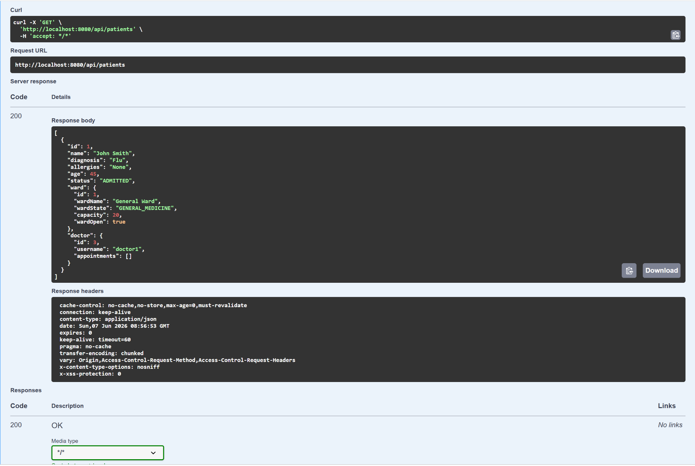
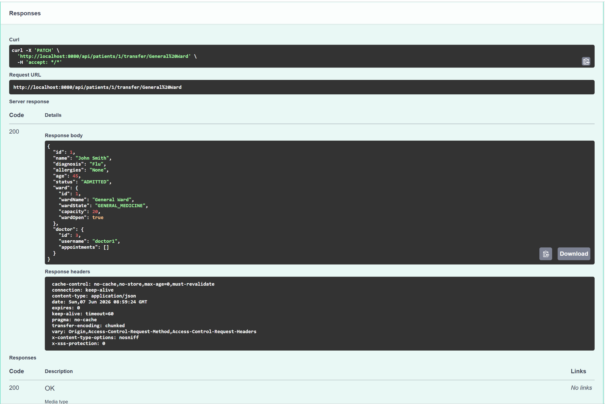
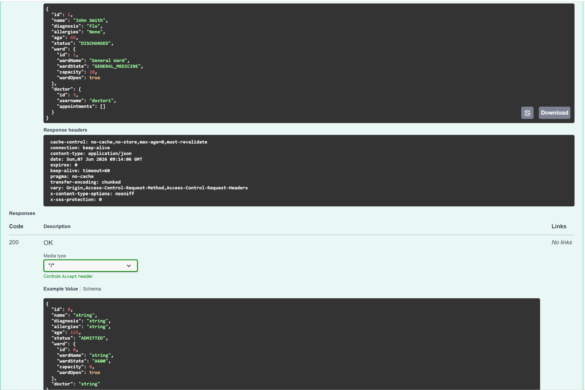

# Hospital Management System

## 📌 Description

A Hospital Management System backend built with Spring Boot that simulates NHS-style hospital workflows.

This project demonstrates backend software engineering concepts including RESTful APIs, layered architecture, JWT authentication, database relationships, and Spring Security integration.

The system supports patient admission, doctor assignment, ward management, patient transfers, and appointment handling.

## 🚀 Features

- Patient admission system
- Patient transfer between wards
- Patient status tracking (ADMITTED / DISCHARGED)
- Doctor management
- Doctor assignment during patient admission
- Ward assignment and management
- Appointment management
- User registration
- User login with JWT authentication
- RESTful APIs
- Spring Security authentication
- H2 in-memory database
- DTO architecture
- Exception handling
- Layered backend structure

## 🛠️ Tech Stack

- Java 17
- Spring Boot
- Spring Security
- Spring Data JPA
- Hibernate
- H2 Database
- Maven
- Swagger / OpenAPI
- Postman
🏗️ Architecture

The application follows a layered architecture:

Controller Layer

Handles HTTP requests and responses through REST endpoints.

Service Layer

Contains business logic for patients, doctors, wards, and appointments.

Repository Layer

Uses Spring Data JPA repositories to interact with the database.

Model Layer

Defines entities and relationships used throughout the application.

DTO Layer

Separates API request and response models from internal entities.

Security Layer

Provides Spring Security configuration and JWT authentication support.

## 📸 Screenshots

### User Registration

### Get All Users

### User Login JWT

### Create Ward

### Create User

### Patient Admitted

### Patient List

### Patient Transfer

### Patient Status Update

▶️ Running the Project
Clone Repository

git clone https://github.com/Peter-c-dev/New-Hospital-management.git

Run Application

mvn spring-boot

Application runs on:

http://localhost:8080

🔐 Authentication

Spring Security authentication is enabled.

The application includes custom user registration and login functionality.

Users can register accounts and authenticate using username and password.

JWT tokens are generated during login and can be used to access secured endpoints.

Passwords are encrypted using BCrypt before being stored in the database.

📡 Example API Endpoints
Patients

Get All Patients

GET /api/patients

Admit Patient

POST /api/patients/admit/{wardName}/{username}

Update Patient Status

PATCH /api/patients/{id}/status

Discharge Patient

DELETE /api/patients/{id}

📈 Future Improvements
PostgreSQL integration
Docker deployment
React frontend
Automated testing
Role-based authorization
CI/CD pipeline with GitHub Actions
