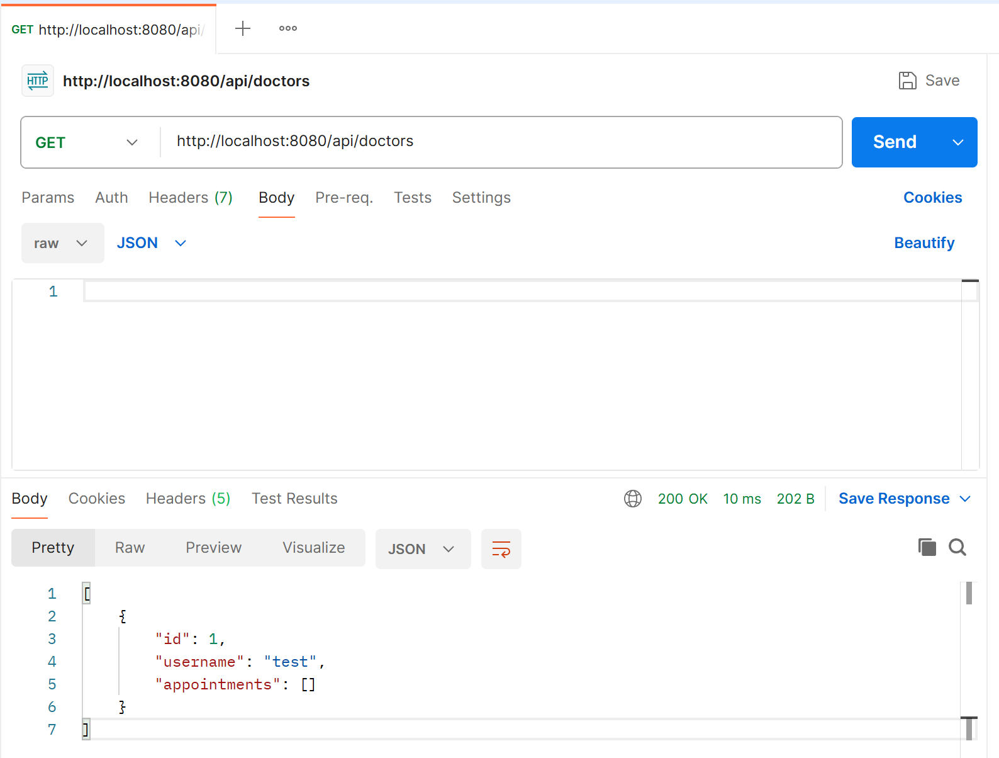
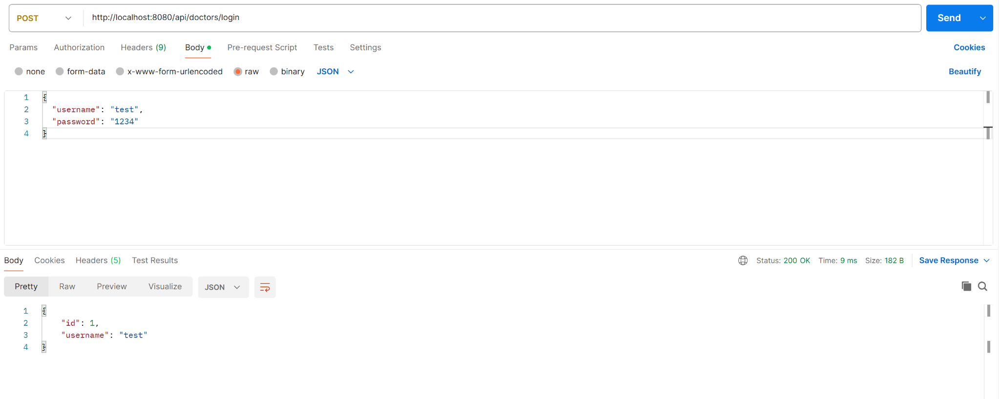

# 🏥 Hospital Management System (Java Swing)

## 📌 Description
A Java Swing application designed to simulate hospital workflows inspired by NHS systems.

This was my first major project and helped me develop skills in object-oriented programming, UI design, and file-based data persistence.

---

## 🚀 Features

- Register and manage patients
- Assign doctors to patients
- File-based data storage
- Simple and clean user interface using Swing
- Modular design following OOP principles

---

## 🛠️ Tech Stack

- Java
- Swing (GUI)
- Object-Oriented Programming
- File Persistence (CSV / TXT)

---

## 📸 API Screenshots

### Create Doctor Endpoint


### Get Doctors Endpoint


### Doctor Login Endpoint


---

## ▶️ Running the Project

### Compile:
```bash
javac *.java
```

### Run:
```bash
java Main
```
